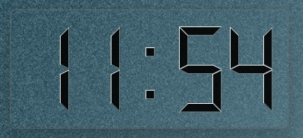

# Qt Widget Clock

A small desktop clock built with **Qt Widgets** and **C++23**.
It displays the local time in an LCD style, stays on top of other windows, and lets users choose a preferred clock color.



## 1) What is the function of this clock?

The app is designed as a lightweight desktop time widget:

- Displays local time in `hh:mm` format.
- Updates every second.
- Blinks the separator (`:`) by alternating between `:` and a space.
- Uses a frameless, transparent, always-on-top window.
- Saves user preferences and restores them on the next start.

## 2) What can the user do? (functional use cases)

- **Read time quickly:** Keep the clock above other windows for quick time checks.
- **Move the clock:** Drag the frameless widget to any desktop position.
- **Open context menu:** Right-click to open actions.
- **Change color:** Open **Preferences** and select one of the available colors.
- **Exit application:** Use context menu action **Exit**.
- **Continue where you left off:** Window geometry/state and selected color are persisted.

## 3) MVC architecture review

### Verdict
The current architecture is still **reasonable and maintainable** for the size of this application.

### Current responsibility split
- **Model**
  - `ClockSettingsModel`: stores/loads color via `QSettings`, emits `colorChanged`.
- **View**
  - `MainWindow` + `main_window.ui`: window shell and visual container.
  - `PreferenceDialog`: UI for choosing a color.
- **Controller / coordinator**
  - `LcdClock`: timer-based time update, palette update, and settings-dialog workflow.

### Why it is still sensible
- Persistence is isolated in one model class.
- Time update + display behavior are centralized in one coordinator (`LcdClock`).
- Window mechanics and dialog UI stay in dedicated UI classes.
- Complexity is low, and the code is easy to navigate.

### Practical note
Strict textbook MVC is slightly blurred (controller opens a dialog directly), but for a compact Qt widget app this trade-off is acceptable.

## 4) File responsibilities (short description)

| File | Responsibility |
|---|---|
| `CMakeLists.txt` | Build setup, Qt package discovery, target creation, install rules. |
| `main.cpp` | Application entry point (`QApplication` init, app metadata, `MainWindow` startup). |
| `main_window.h/.cpp` | Main frameless window, drag behavior, context menu, geometry/state persistence. |
| `main_window.ui` | Qt Designer UI definition (contains LCD display widget). |
| `lcd_clock.h/.cpp` | Clock logic: periodic update, blinking separator, color application, preferences flow. |
| `clock_settings_model.h/.cpp` | Settings model for color persistence and change notification. |
| `preference_dialog.h/.cpp` | Dialog for selecting the clock color (OK/Cancel). |
| `enum_index.h` | Small enum utility helper. |
| `images/app_view.jpg` | Screenshot of the running app. |
| `images/ide_view.jpg` | Screenshot of the IDE/project view. |
| `LICENSE` | MIT license text. |

## 5) Build and run

### Requirements
- CMake 3.16+
- C++23 compiler
- Qt Widgets (Qt 5 or Qt 6)

### Commands
```bash
cmake -S . -B build
cmake --build build
```

Run binary (single-config generators):
```bash
./build/qt_widget_clock
```

For multi-config generators (e.g., Visual Studio), run the executable from the chosen configuration directory.

## License

MIT License. See `LICENSE`.
